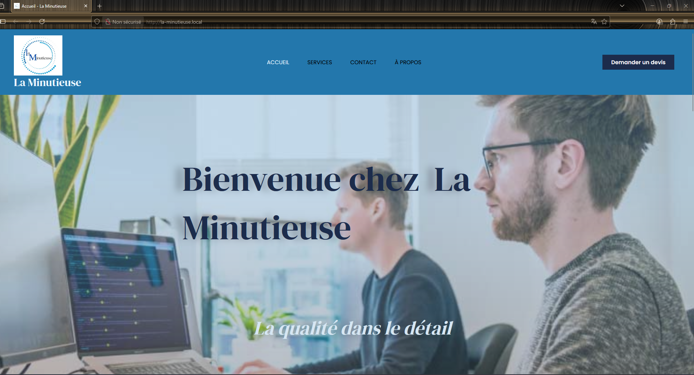
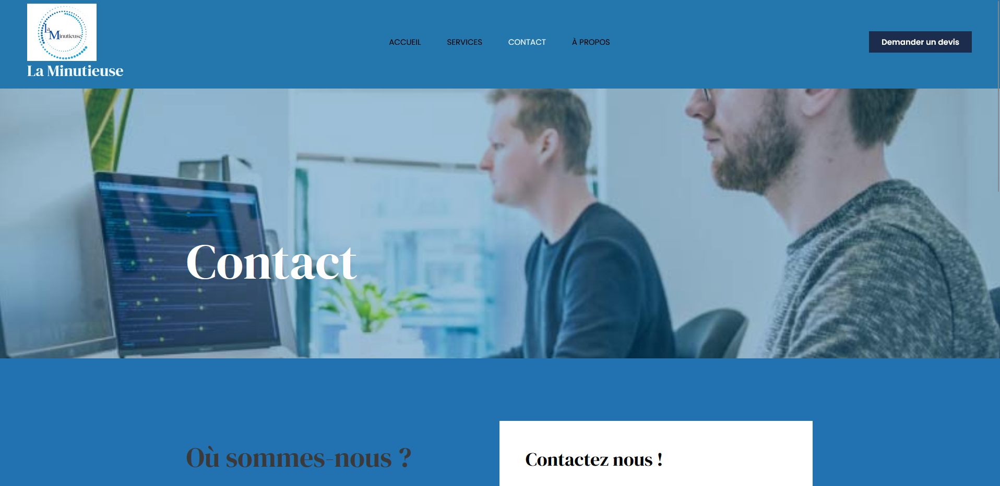

# Site-la-Minutieuse# 🌟 La Minutieuse – Site vitrine professionnel

Bienvenue sur le dépôt du site vitrine **La Minutieuse**, un site professionnel conçu avec WordPress pour présenter des services, permettre la prise de rendez-vous et faciliter le contact avec les clients.

---

## 📸 Aperçu visuel

- **Page d’accueil**  
  

- **Services**  
  

- **À propos**  
  

- **Contact**  
  

- **Réservation de rendez-vous**  
  

---

## 🛠️ Technologies utilisées

- CMS : **WordPress**
- Thème : *(à préciser si personnalisé ou nom du thème utilisé)*
- Plugins principaux :
  - **Formulaire de contact** (ex. : Contact Form 7, WPForms…)
  - **Système de prise de rendez-vous** (ex. : BookingPress, Simply Schedule Appointments…)

---

## 📄 Pages disponibles

- **Accueil** : Introduction de l’entreprise, slogan percutant, visuels attrayants et appels à l’action visibles.
- **Services** : Présentation claire des prestations proposées.
- **À propos** : Valeurs, expérience, histoire du projet.
- **Contact** : Formulaire simple et efficace, informations de contact.
- **Réservation de rendez-vous** : Calendrier pour planifier un appel téléphonique ou une visio.

---

## ✅ Fonctionnalités clés

- Design responsive (adapté aux ordinateurs, tablettes et mobiles)
- Envoi d’e-mails via formulaire de contact
- Intégration d’un système de **prise de rendez-vous**
- Navigation fluide et claire
- Boutons d’appel à l’action visibles pour convertir les visiteurs

---

## 🚧 État du projet

Le site est **en cours d’achèvement**, mais il est déjà **fonctionnel et navigable**. Des ajustements mineurs sont encore à venir.

---

